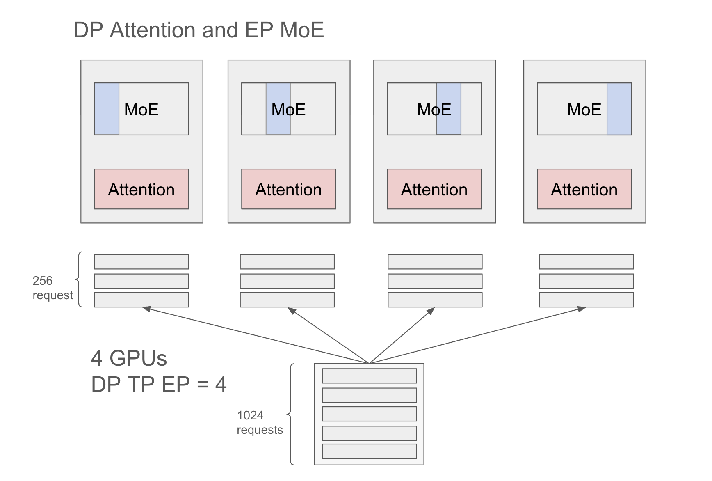

# DeepSeek Deployment on GB200 NVL72 with Pipeline Parallelism and Large-Scale Expert Parallelism (Part II)

## Prefill Pool Config

**Setup:** 1 node with 4 GPUs  
**Parallelism:** TP=DP=EP=4  
**Benchmark:** Batch size 1024, input length 1024 tokens



## Request Distribution

With TP=DP=EP=4, each GPU receives 1024 / 4 = 256 requests per batch. Each request contains 1024 tokens.

## Configuration Parameters

Key parameters control the prefill pool token allocation. **Note:** These values represent totals across all GPUs, so divide by the number of GPUs to get per-GPU values.

### Scenario 1: 16k Tokens Per Forward Pass

If each GPU handles 16k tokens per forward pass:
- 16k tokens ÷ 1k tokens/request = 16 requests per forward pass
- 256 requests ÷ 16 requests/pass = 16 forward passes total

**Configuration:**

```bash
--max-total-tokens 128k       # Total tokens for prefill + decode pools
--max-prefill-tokens 16k      # Per-GPU: 4k tokens
--chunked-prefill-size 64k    # Aggregated across GPUs (16k × 4)
```

**Results** (see `exp-01-16k/`):
```
TTFT: 17.12s
Input throughput: 20,229 tok/s - 57,675.34 tok/s
```

### Scenario 2: 32k Tokens Per Forward Pass

If GPU utilization is low at 16k tokens, increase to 32k tokens per forward pass for higher throughput.

**Configuration:**

```bash
--max-total-tokens 128k       # Total tokens for prefill + decode pools
--max-prefill-tokens 32k      # Per-GPU: 8k tokens
--chunked-prefill-size 128k   # Aggregated across GPUs (32k × 4)
```

**Results** (see `exp-02-32k/`):
```
TTFT: 16.68s
Input throughput: 20,403.99 tok/s - 40319.38 tok/s
```

## Notes

- `--max-total-tokens` combines prefill and decode tokens; set conservatively high
- `--chunked-prefill-size` is aggregated across all GPUs; too-low values split requests into multiple forward passes
- `--max-running-requests` typically not a bottleneck since most requests are queued rather than running

See `launch.sh` for full deployment script.

**Blog:** https://lmsys.org/blog/2025-09-25-gb200-part-2/

## Decode Pool Config

See https://github.com/shifangx/Scripts-SGLang
